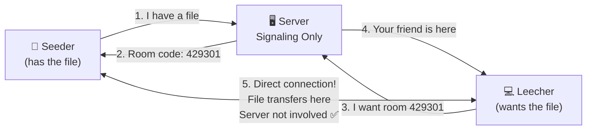
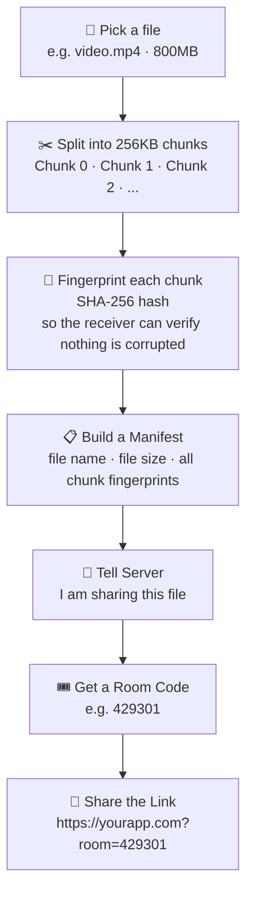
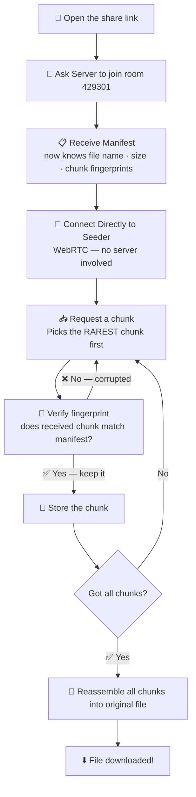
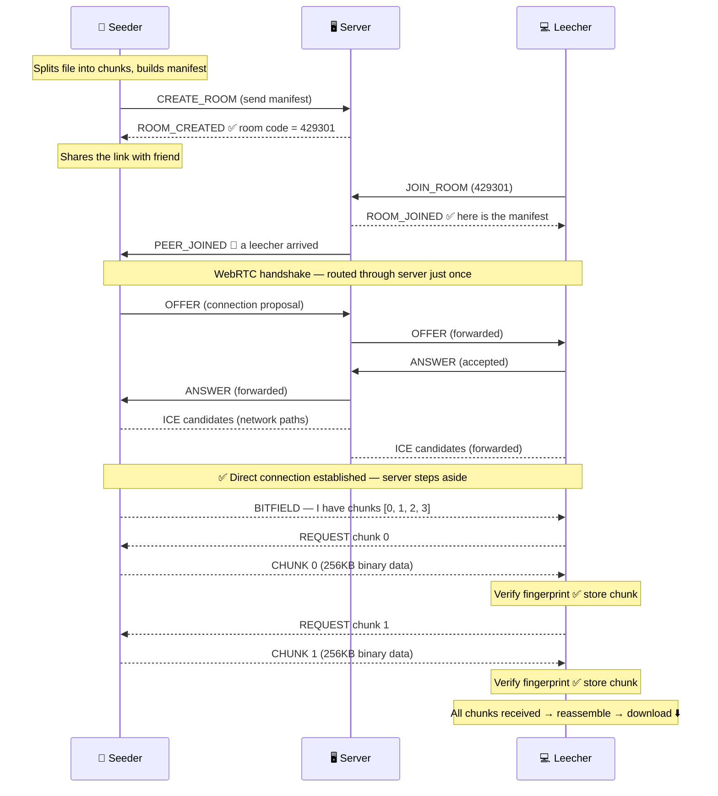
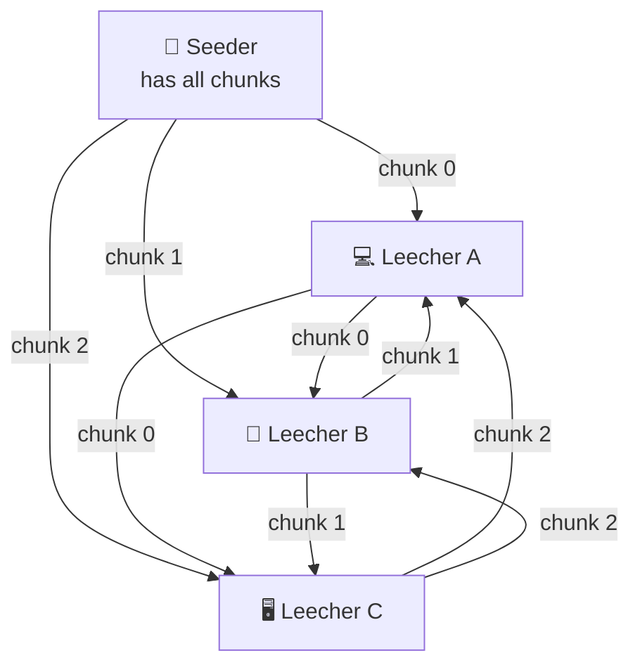
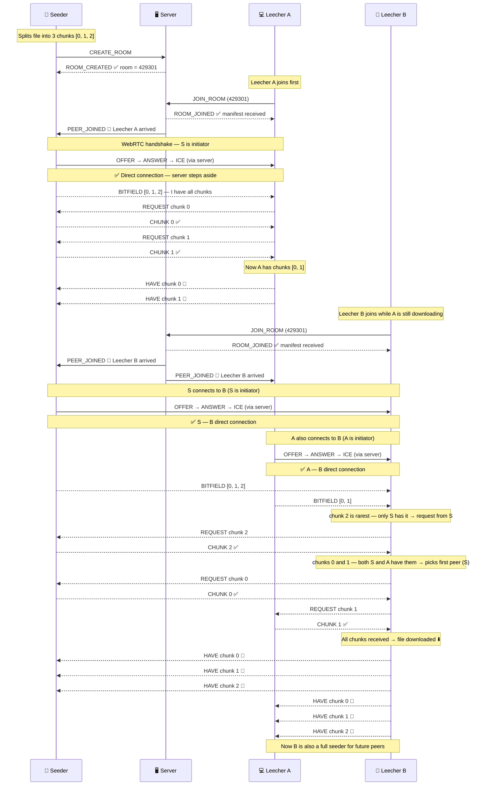

# P2P File Share

A browser-based peer-to-peer file sharing app inspired by BitTorrent. Files are transferred **directly between browsers** — the server only helps peers find each other, like a matchmaker.

---

## The Simple Analogy

> Imagine you want to share a pizza recipe with your friend.
> You call a **reception desk** (server) and say *"I have a recipe, give me a room number"*.
> Your friend calls the same desk and says *"I want room 429"*.
> The desk introduces you two — then **steps aside**.
> From that point, you talk directly with your friend. The desk is out of the loop.

That's exactly how this app works — except instead of a recipe, it's any file.

---

## The Big Picture



---

## Step 1 — Seeder: Sharing a File



---

## Step 2 — Leecher: Downloading a File



---

## Full Conversation — Seeder, Server, and Leecher



---

## What Happens With Multiple Peers

Once a leecher finishes downloading a chunk, it becomes a seeder for that chunk too.
Everyone shares with everyone — the more peers, the faster the download.



---

## Full Conversation — With Multiple Peers



---

## Tech Stack

| Layer | Technology |
|-------|-----------|
| Signaling server | Python · FastAPI · WebSocket |
| P2P transport | WebRTC DataChannel |
| Frontend | Vanilla JS · HTML · CSS |
| Integrity check | SHA-256 (Web Crypto API) |

---

## Project Structure

```
p2pexp/
├── server/
│   ├── main.py          # signaling server — room management + message forwarding
│   └── requirements.txt
└── client/
    ├── index.html
    ├── style.css
    └── js/
        ├── chunker.js   # splits file into 256KB pieces
        ├── verifier.js  # SHA-256 fingerprinting and verification
        ├── manifest.js  # builds and parses the file manifest
        ├── tracker.js   # WebSocket client — talks to signaling server
        ├── peer.js      # one WebRTC connection per peer
        ├── swarm.js     # manages all peers and chunk availability map
        ├── downloader.js# rarest-first chunk scheduling
        └── ui.js        # seeder and leecher UI
```

---

## Run Locally

```bash
cd server
python -m venv .venv
source .venv/bin/activate
pip install -r requirements.txt
python -m uvicorn main:app --reload
```

Open `http://localhost:8000` in **Firefox** (two tabs — one seeder, one leecher).

> Chrome hides local IPs behind mDNS hostnames for privacy, which breaks same-machine WebRTC without a TURN relay server. Firefox does not have this issue.

---

## Known Limitations

| Limitation | Reason |
|------------|--------|
| Entire file held in RAM | Chunks stored as ArrayBuffers in memory — large files may crash on mobile |
| Same-WiFi on Chrome fails | Chrome mDNS + routers not supporting hairpin NAT |
| No TURN server included | Add one (e.g. [Metered](https://metered.ca)) in `peer.js` for full cross-network reliability |